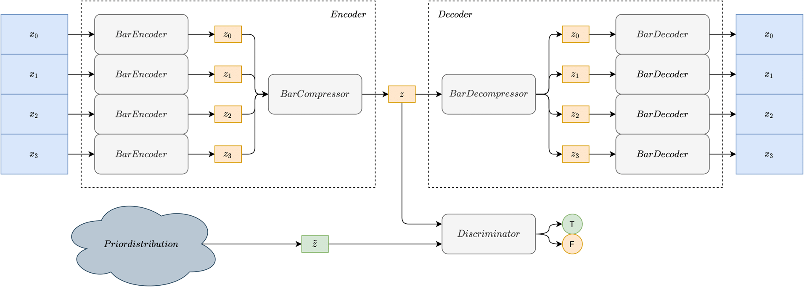

# Calliope: Adversarial Transformer Autoencoder

This repository contains the implementation of Calliope, an Adversarial Transformer Autoencoder for music generation and latent space interpolation.

## Dataset
In order to create the dataset, it is necessary to choose the desired number of bars n_bars from the config file, the number of songs to generate (early_stop, if it is zero then all the songs found in the raw dataset are converted) and then launch:
>python create_bar_dataset.py

## Training
The training uses Weight & Bias in order to control the training. Login in W&B with your credential.
The training can be started with
>python train.py

In order to check the progress of the model on W&B, it is needed a way to convert midi files into wav.
It is necessary to download the sound font from [here](http://timtechsoftware.com/ad.html?keyword=sf2%20format?file_name=the%20General%20MIDI%20Soundfont?file_url=uploads/GeneralUser_GS_SoftSynth_v144.sf2).
and check that utilities/midi_to_wav is correctly seeing the file.

Otherwise, the pretrained weights can be downloaded [here](https://drive.google.com/drive/folders/1zn0w3mPH7Qxf9Oko_Bn3R26HlUn2vhYR?usp=sharing).

## Testing
The model can be tested in different ways.
With:
>python test.py

are tested the reconstruction ability, the generation ability and the interpolation ability.
With:
>python test_musegan.py

the same metrics of the MuseGAN model are computed on 20000 generated bars.
With:
>python test_musicvae.py

the reconstruction accuracy are computed.
With:
>python create_base.py

the model generates four repetitions of the n_bars generated bars.